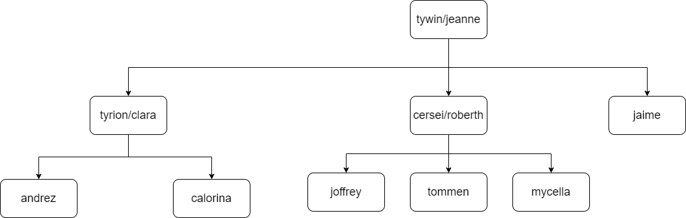

# Ejercicio de familia
la intencion del ejecicio es generar relaciones utiizando como esquema una relacion de familia normal, para realizalo utilizamos la siquiente imagen, la cual es una arbol genealogico simple.

