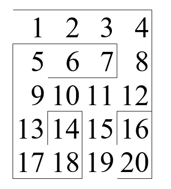

# Ejercicio de laberinto
Acontinuacion se representara el laberinto principla, que se representaran las relaciones entre los puntos de cordenadad de cada sector, la intencion es probar si exite un recorido capaz de pasar el laberinto.

